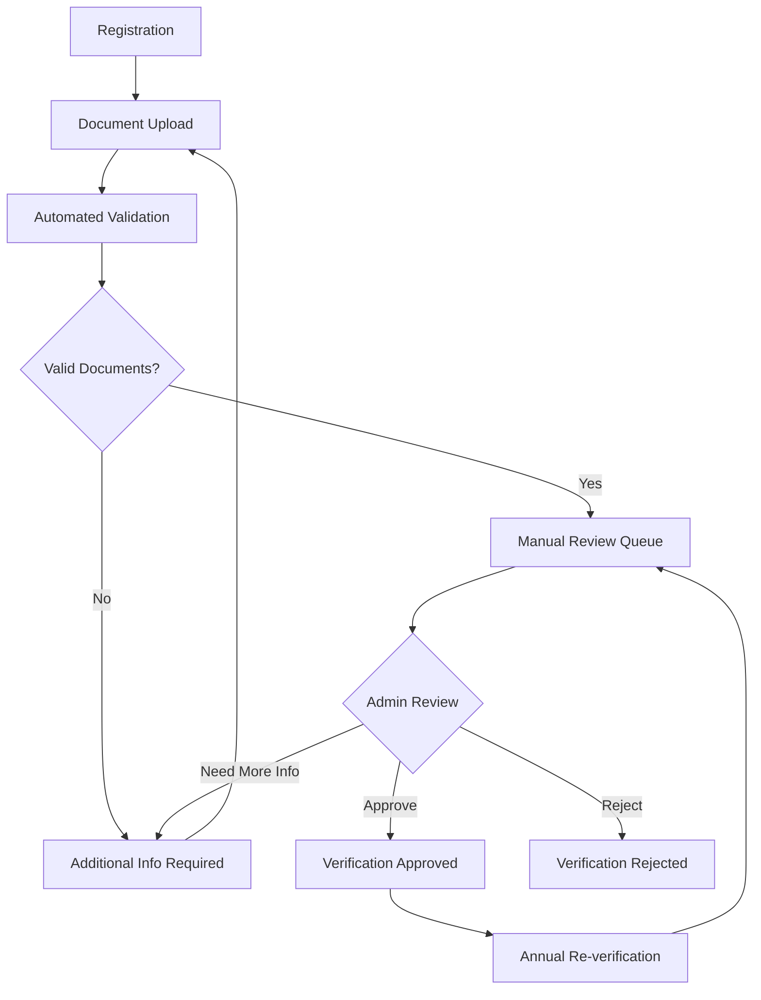

# Business Verification & Tier Security Framework
## *Closing Critical Revenue & Resource Exploitation Gaps*

---

## 🚨 Executive Summary

**Critical Vulnerabilities Identified:**
- Multi-owner tier exploitation enabling unlimited free riding
- Resource abuse through location multiplication without verification
- Revenue loss potential: $50,000+ monthly per organized conspiracy
- Platform sustainability risk due to resource/payment mismatch

**Proposed Solution:**
Comprehensive business verification system with per-location accountability, eliminating exploitation while enabling legitimate business collaboration.

---

## 📊 Current Vulnerabilities

### 1. Tier Exploitation Vectors

**Free Rider Problem:**
```
Scenario: Coffee Shop Tenant
- Owner A: Enterprise ($200/month)
- Owner B: Starter ($20/month)  
- Result: Owner B gets Enterprise features for Starter price
- Revenue Loss: $180/month per exploitation
```

**Multi-Location Conspiracy:**
```
Scenario: Business Network Exploitation
- 1 Enterprise User: $200/month
- 25 Locations with Starter Co-owners: $500/month total paid
- Enterprise Features Delivered: $5,000/month value
- Net Platform Loss: $4,500/month per conspiracy ring
```

### 2. Resource Abuse Patterns

**Platform Resource Multiplication:**
- **API Calls:** 25x usage on 1 subscription
- **Storage:** Unlimited locations, single payment
- **Processing:** 25x computational load
- **Support:** 25x support cases, 1 payment
- **Network:** 25x bandwidth consumption

**Verification Gaps:**
- No business entity validation per location
- No individual accountability per owner
- No resource usage limits per location
- No fraud prevention mechanisms

---

## 🛡️ Proposed Verification Framework

### Phase 1: Business Entity Verification

**Per-Location Requirements:**
```
Business Verification Checklist:
□ Business License Validation
□ Tax ID (EIN/SSN) Verification  
□ Physical Address Confirmation
□ Banking Information Validation
□ Ownership Documentation
□ Industry Classification
□ Compliance Status Check
```

**Verification Process:**
1. **Document Upload** - Business license, tax docs, bank statements
2. **Third-Party Validation** - Dun & Bradstreet, Secretary of State lookup
3. **Address Verification** - USPS validation, Google Business verification
4. **Banking Confirmation** - Micro-deposit verification
5. **Manual Review** - High-risk cases flagged for human review

### Phase 2: Individual Owner Verification

**Per-Owner Requirements:**
```
Owner Verification Checklist:
□ Government ID Verification (KYC)
□ Business Role Confirmation
□ Authorized Signatory Status
□ Individual Payment Method
□ Background Check (if required)
□ Professional References
```

**Verification Levels:**
- **Basic:** ID + Payment method
- **Standard:** + Business role confirmation
- **Premium:** + Background check + References

### Phase 3: Resource-Based Accountability

**Per-Location Resource Tracking:**
```
Resource Monitoring:
- API Usage per location
- Storage consumption per location  
- Processing time per location
- Support tickets per location
- Feature usage per location
```

**Resource Limits:**
- Tier-based API quotas per location
- Storage limits per location
- Processing time limits per location
- Support ticket limits per tier

---

## 💰 Revised Pricing Model

### Option A: Per-Location Subscription (Recommended)

**Pricing Structure:**
```
Starter Tier: $49/month per location
- Basic features
- 10,000 API calls/month
- 5GB storage
- Email support

Professional Tier: $149/month per location  
- Advanced features
- 50,000 API calls/month
- 25GB storage
- Priority support

Enterprise Tier: $299/month per location
- All features
- 200,000 API calls/month
- 100GB storage
- Dedicated support
```

**Multi-Location Discounts:**
- 2-5 locations: 10% discount
- 6-15 locations: 15% discount  
- 16+ locations: 20% discount
- Enterprise contracts: Custom pricing

### Option B: Hybrid Resource Model

**Base + Usage Pricing:**
```
Base Subscription: $99/month per location
+ API Overages: $0.01 per call above limit
+ Storage Overages: $10 per GB above limit
+ Processing Overages: $5 per CPU hour above limit
+ Premium Support: $50/month per location
```

### Option C: Verified Business Network

**Verification-Based Pricing:**
```
Verification Fee: $199 one-time per location
Monthly Subscription: Tier-based per location
Resource Sharing: Only within verified business network
Cross-Network Limits: Strict enforcement
```

---

## 🔧 Implementation Roadmap

### Phase 1: Emergency Restrictions (Week 1-2)
**Immediate Actions:**
- Freeze new multi-owner additions
- Audit existing multi-owner tenants
- Implement basic usage monitoring
- Flag suspicious patterns

### Phase 2: Verification System (Month 1-3)
**Technical Implementation:**
- Build business verification API
- Integrate third-party validation services
- Create verification dashboard
- Implement resource tracking

**Business Process:**
- Define verification criteria
- Create review workflows
- Train support team
- Establish appeal process

### Phase 3: Pricing Migration (Month 3-6)
**Grandfathering Strategy:**
- Existing users: 6-month grace period
- New users: Immediate new model
- Migration incentives: Discount programs
- Communication plan: Clear timeline

### Phase 4: Full Enforcement (Month 6+)
**Complete Migration:**
- All locations verified
- All users on new pricing
- Resource limits enforced
- Monitoring systems active

---

## 📈 Business Impact Analysis

### Revenue Protection:
- **Eliminated Exploitation:** $50,000+/month potential savings
- **Fair Pricing:** Revenue matches resource consumption
- **Premium Positioning:** Verified business network commands higher prices

### Operational Benefits:
- **Resource Optimization:** Predictable usage patterns
- **Support Efficiency:** Accountable users, fewer abuse cases
- **Platform Stability:** Sustainable growth model

### Competitive Advantages:
- **Trust Network:** Verified businesses only
- **Compliance Ready:** Built-in verification for regulations
- **Enterprise Appeal:** Professional, accountable platform

---

## ⚖️ Risk Mitigation

### Customer Retention Risks:
- **Mitigation:** Generous grandfathering period
- **Incentives:** Migration discounts and feature upgrades
- **Communication:** Clear value proposition explanation

### Implementation Risks:
- **Technical:** Phased rollout with rollback capability
- **Operational:** Dedicated verification team
- **Legal:** Compliance review for verification requirements

### Competitive Risks:
- **Market Position:** First-mover advantage in verified business networks
- **Differentiation:** Premium positioning vs commodity platforms

---

## 🎯 Success Metrics

### Security Metrics:
- Exploitation attempts blocked: Target 100%
- Fraudulent accounts detected: Target 95%+
- Resource abuse incidents: Target <1% of users

### Business Metrics:
- Revenue per location: Target 300% increase
- Customer lifetime value: Target 200% increase
- Platform resource efficiency: Target 400% improvement

### Operational Metrics:
- Verification completion rate: Target 95%+
- Support ticket reduction: Target 50%
- User satisfaction: Maintain 85%+

---

## � Verification Workflow System

### Multi-Phase Verification Flow

**Workflow States:**
```
1. REGISTRATION_PENDING      - Initial business registration submitted
2. DOCUMENTS_SUBMITTED       - All required documents uploaded
3. UNDER_REVIEW             - Admin team reviewing submission
4. ADDITIONAL_INFO_REQUIRED - More documentation needed
5. VERIFICATION_APPROVED    - Business verified and active
6. VERIFICATION_REJECTED    - Application denied
7. VERIFICATION_EXPIRED     - Verification period expired
8. RE_VERIFICATION_REQUIRED - Annual re-verification needed
```

**Workflow Progression:**


### Secure Document Management System

**Document Storage Architecture:**
- **Encryption at Rest:** AES-256 encryption for all documents
- **Encryption in Transit:** TLS 1.3 for all uploads/downloads
- **Access Control:** Role-based access with comprehensive audit trails
- **Retention Policy:** 7-year retention for regulatory compliance
- **Geographic Restrictions:** Data residency compliance (US, EU, etc.)
- **Backup & Recovery:** Encrypted backups with 99.99% availability SLA

**Required Document Types:**
```
Business Entity Documents:
□ Business License (State/Local)
□ Tax ID Documentation (EIN/SSN)
□ Articles of Incorporation/Organization
□ Operating Agreements/Bylaws
□ Banking Information & Statements
□ Business Insurance Certificates
□ Professional Licenses (if applicable)
□ Zoning/Permit Documentation

Individual Owner Documents:
□ Government-issued Photo ID
□ Proof of Address (Utility Bill, etc.)
□ Authorized Signatory Documentation
□ Professional References (2 minimum)
□ Background Check Results (if required)
□ Social Security Number Verification
```

**Document Security Features:**
- **Client-side encryption** before upload using Web Crypto API
- **Server-side re-encryption** with platform-managed keys
- **Key rotation** every 90 days with zero-downtime
- **Access logging** for all document views and downloads
- **Digital watermarking** for downloaded documents
- **Automatic redaction** of sensitive data in logs

### Database Schema Implementation

```sql
-- Business Verification Requests
CREATE TABLE business_verification_requests (
  id VARCHAR(36) PRIMARY KEY DEFAULT gen_random_uuid(),
  tenant_id VARCHAR(36) NOT NULL REFERENCES tenant(id),
  requester_user_id VARCHAR(36) NOT NULL REFERENCES users(id),
  status verification_status NOT NULL DEFAULT 'REGISTRATION_PENDING',
  business_name VARCHAR(255) NOT NULL,
  business_type VARCHAR(100),
  tax_id VARCHAR(50),
  business_address JSONB,
  business_phone VARCHAR(20),
  business_email VARCHAR(255),
  industry_classification VARCHAR(100),
  employee_count_range VARCHAR(50),
  annual_revenue_range VARCHAR(50),
  submitted_at TIMESTAMP DEFAULT NOW(),
  reviewed_at TIMESTAMP,
  approved_at TIMESTAMP,
  rejected_at TIMESTAMP,
  expires_at TIMESTAMP,
  reviewer_user_id VARCHAR(36) REFERENCES users(id),
  rejection_reason TEXT,
  verification_notes TEXT,
  risk_score INTEGER DEFAULT 0,
  third_party_validation_status JSONB,
  created_at TIMESTAMP DEFAULT NOW(),
  updated_at TIMESTAMP DEFAULT NOW(),
  
  CONSTRAINT valid_status CHECK (status IN (
    'REGISTRATION_PENDING',
    'DOCUMENTS_SUBMITTED', 
    'UNDER_REVIEW',
    'ADDITIONAL_INFO_REQUIRED',
    'VERIFICATION_APPROVED',
    'VERIFICATION_REJECTED',
    'VERIFICATION_EXPIRED',
    'RE_VERIFICATION_REQUIRED'
  ))
);

-- Verification Documents (Encrypted Storage)
CREATE TABLE verification_documents (
  id VARCHAR(36) PRIMARY KEY DEFAULT gen_random_uuid(),
  verification_request_id VARCHAR(36) NOT NULL REFERENCES business_verification_requests(id),
  document_type VARCHAR(100) NOT NULL,
  document_category VARCHAR(50) NOT NULL,
  document_name VARCHAR(255) NOT NULL,
  original_filename VARCHAR(255),
  encrypted_file_path VARCHAR(500) NOT NULL,
  encryption_key_id VARCHAR(100) NOT NULL,
  file_size BIGINT NOT NULL,
  mime_type VARCHAR(100),
  checksum VARCHAR(128),
  uploaded_at TIMESTAMP DEFAULT NOW(),
  verified_at TIMESTAMP,
  verification_status VARCHAR(50) DEFAULT 'PENDING',
  verification_notes TEXT,
  expiration_date DATE,
  is_sensitive BOOLEAN DEFAULT true,
  access_count INTEGER DEFAULT 0,
  last_accessed_at TIMESTAMP,
  
  CONSTRAINT valid_verification_status CHECK (verification_status IN (
    'PENDING', 'APPROVED', 'REJECTED', 'EXPIRED', 'REQUIRES_UPDATE'
  ))
);

-- Verification Audit Trail
CREATE TABLE verification_audit_log (
  id VARCHAR(36) PRIMARY KEY DEFAULT gen_random_uuid(),
  verification_request_id VARCHAR(36) NOT NULL REFERENCES business_verification_requests(id),
  action VARCHAR(100) NOT NULL,
  actor_user_id VARCHAR(36) NOT NULL REFERENCES users(id),
  actor_role VARCHAR(50),
  previous_status VARCHAR(50),
  new_status VARCHAR(50),
  affected_document_id VARCHAR(36) REFERENCES verification_documents(id),
  notes TEXT,
  ip_address INET,
  user_agent TEXT,
  session_id VARCHAR(100),
  created_at TIMESTAMP DEFAULT NOW(),
  
  -- Index for performance
  INDEX idx_verification_audit_request (verification_request_id),
  INDEX idx_verification_audit_actor (actor_user_id),
  INDEX idx_verification_audit_created (created_at)
);

-- Third-party Validation Results
CREATE TABLE verification_third_party_checks (
  id VARCHAR(36) PRIMARY KEY DEFAULT gen_random_uuid(),
  verification_request_id VARCHAR(36) NOT NULL REFERENCES business_verification_requests(id),
  provider VARCHAR(50) NOT NULL, -- 'duns_bradstreet', 'secretary_of_state', 'irs_ein'
  check_type VARCHAR(50) NOT NULL,
  request_payload JSONB,
  response_payload JSONB,
  status VARCHAR(50) NOT NULL,
  confidence_score DECIMAL(3,2),
  performed_at TIMESTAMP DEFAULT NOW(),
  expires_at TIMESTAMP,
  cost_cents INTEGER,
  
  CONSTRAINT valid_third_party_status CHECK (status IN (
    'PENDING', 'COMPLETED', 'FAILED', 'EXPIRED', 'INVALID'
  ))
);
```

### API Workflow Endpoints

**Business Verification Management:**
```typescript
// Verification Request Lifecycle
POST   /api/verification/business/submit
GET    /api/verification/business/:id/status
PUT    /api/verification/business/:id/documents
DELETE /api/verification/business/:id/documents/:docId
GET    /api/verification/business/:id/documents/:docId/download
POST   /api/verification/business/:id/resubmit

// Document Management
POST   /api/verification/documents/upload
GET    /api/verification/documents/:id/status
PUT    /api/verification/documents/:id/replace
DELETE /api/verification/documents/:id

// Status Updates & Notifications
GET    /api/verification/business/:id/timeline
POST   /api/verification/business/:id/request-update
GET    /api/verification/business/requirements
```

**Admin Review Interface:**
```typescript
// Review Queue Management
GET    /api/admin/verification/queue
GET    /api/admin/verification/queue/stats
PUT    /api/admin/verification/queue/assign/:id
GET    /api/admin/verification/:id/full-details

// Document Review
GET    /api/admin/verification/:id/documents
POST   /api/admin/verification/:id/documents/:docId/verify
POST   /api/admin/verification/:id/documents/:docId/reject
GET    /api/admin/verification/:id/documents/:docId/view

// Decision Making
POST   /api/admin/verification/:id/approve
POST   /api/admin/verification/:id/reject  
POST   /api/admin/verification/:id/request-additional-info
PUT    /api/admin/verification/:id/extend-deadline

// Third-party Integrations
POST   /api/admin/verification/:id/run-background-checks
GET    /api/admin/verification/:id/third-party-results
POST   /api/admin/verification/:id/manual-override
```

### Admin Dashboard Integration

**Verification Queue Management Interface:**
```typescript
interface VerificationDashboard {
  queueStats: {
    pendingReviews: number;
    inProgressReviews: number;
    overdueReviews: number;
    completedToday: number;
    averageReviewTime: number; // in hours
    slaBreaches: number;
  };
  
  priorityQueue: VerificationRequest[];
  myAssignedReviews: VerificationRequest[];
  recentDecisions: VerificationDecision[];
  
  performanceMetrics: {
    approvalRate: number;
    rejectionRate: number;
    averageDocumentCount: number;
    riskScoreDistribution: number[];
    topRejectionReasons: string[];
  };
}

interface VerificationReviewInterface {
  request: VerificationRequest;
  documents: VerificationDocument[];
  auditTrail: AuditLogEntry[];
  thirdPartyChecks: ThirdPartyValidation[];
  riskAssessment: RiskAssessment;
  similarCases: VerificationRequest[];
}
```

**Review Interface Features:**
- **Split-screen document viewer** with annotation tools
- **Real-time collaboration** for multi-reviewer cases
- **Automated risk scoring** based on document analysis
- **Third-party validation integration** (D&B, Secretary of State, IRS)
- **Batch processing** for low-risk, similar applications
- **Mobile-responsive interface** for remote review
- **Keyboard shortcuts** for efficient processing

### Security & Compliance Framework

**Data Protection Measures:**
```typescript
// Encryption Configuration
const ENCRYPTION_CONFIG = {
  algorithm: 'AES-256-GCM',
  keyRotationInterval: '90 days',
  backupEncryption: 'AES-256-CBC',
  transitEncryption: 'TLS 1.3',
  keyManagement: 'AWS KMS / Azure Key Vault'
};

// Access Control Matrix
const ACCESS_PERMISSIONS = {
  'PLATFORM_ADMIN': ['view_all', 'approve_all', 'delete_documents'],
  'VERIFICATION_ADMIN': ['view_assigned', 'approve_assigned', 'request_info'],
  'VERIFICATION_REVIEWER': ['view_assigned', 'review_documents', 'recommend'],
  'BUSINESS_OWNER': ['view_own', 'upload_documents', 'respond_to_requests'],
  'TENANT_ADMIN': ['view_tenant', 'assist_upload']
};
```

**Compliance Features:**
- **GDPR Article 17** - Right to erasure implementation
- **GDPR Article 20** - Data portability for verification records
- **SOC 2 Type II** - Security controls and annual audits
- **PCI DSS Level 1** - Payment card data protection
- **CCPA Section 1798.100** - California privacy rights
- **PIPEDA** - Canadian privacy law compliance
- **ISO 27001** - Information security management

**Audit & Monitoring:**
```typescript
// Real-time Monitoring
const MONITORING_ALERTS = {
  suspiciousActivity: 'Multiple failed document uploads',
  dataAccess: 'Unusual document access patterns',
  systemSecurity: 'Encryption key rotation failures',
  compliance: 'Data retention policy violations',
  performance: 'Review SLA breaches'
};

// Automated Compliance Checks
const COMPLIANCE_AUTOMATION = {
  dataRetention: 'Auto-archive after 7 years',
  accessReview: 'Quarterly access permission audit',
  encryptionValidation: 'Daily encryption integrity checks',
  backupTesting: 'Monthly backup restoration tests'
};
```

### Integration with Existing Systems

**Tenant Management Integration:**
```typescript
// Automatic Tier Adjustment Post-Verification
interface TenantVerificationStatus {
  verificationLevel: 'UNVERIFIED' | 'BASIC' | 'STANDARD' | 'PREMIUM';
  verifiedAt: Date;
  expiresAt: Date;
  allowedFeatures: string[];
  resourceLimits: ResourceLimits;
}

// Feature Access Control
const VERIFICATION_FEATURE_MATRIX = {
  'UNVERIFIED': ['basic_listing', 'limited_api_calls'],
  'BASIC': ['standard_listing', 'moderate_api_calls', 'basic_analytics'],
  'STANDARD': ['enhanced_listing', 'full_api_access', 'advanced_analytics'],
  'PREMIUM': ['all_features', 'unlimited_api', 'priority_support', 'custom_integrations']
};
```

**Billing System Integration:**
```typescript
// Verification-Based Billing
interface VerificationBilling {
  verificationFee: number; // One-time fee per location
  recurringFee: number;    // Annual re-verification
  expeditedFee: number;    // Fast-track processing
  documentStorageFee: number; // Per GB per month
}

// Automatic Billing Triggers
const BILLING_EVENTS = {
  'VERIFICATION_APPROVED': 'Charge verification fee',
  'DOCUMENTS_SUBMITTED': 'Charge document processing fee',
  'EXPEDITED_REVIEW': 'Charge priority processing fee',
  'ANNUAL_RENEWAL': 'Charge re-verification fee'
};
```

---

## �🚀 Immediate Next Steps

1. **Executive Approval** - Present findings and get go/no-go decision
2. **Technical Assessment** - Detailed implementation planning
3. **Legal Review** - Verification requirements compliance check
4. **Customer Communication** - Prepare announcement strategy
5. **Team Assembly** - Verification team hiring and training

---

**This framework transforms a critical vulnerability into a competitive advantage, establishing the platform as the premier verified business network while protecting revenue and resources.**

**Recommendation: Proceed with immediate Phase 1 restrictions while developing full verification system.**

---
*Document prepared: November 19, 2025*  
*Classification: Business Critical - Revenue Protection*
