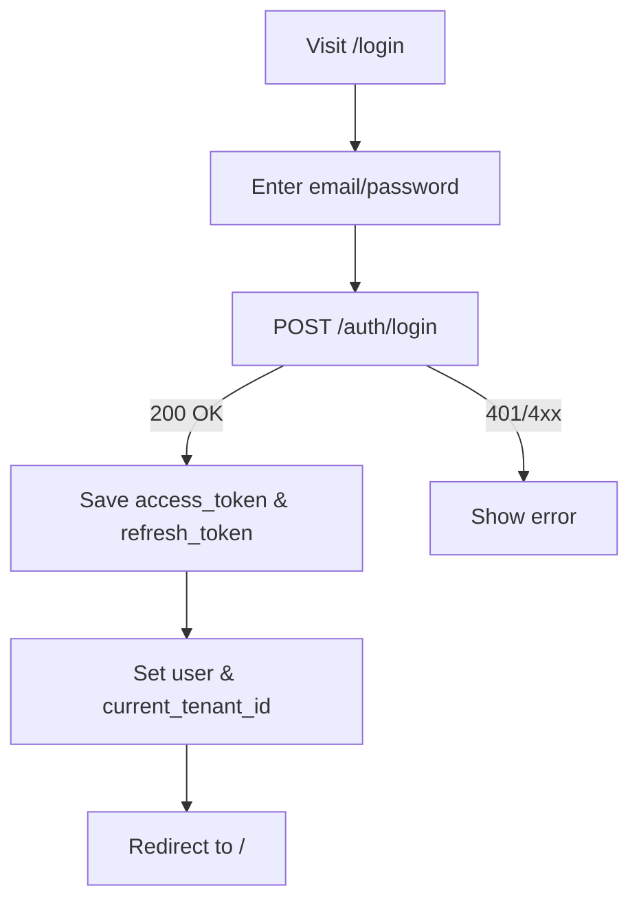
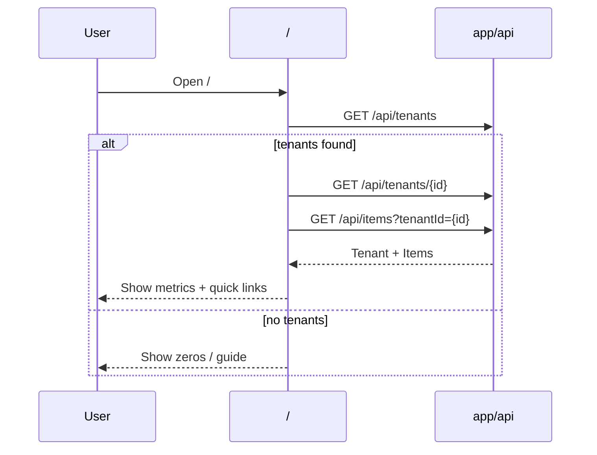
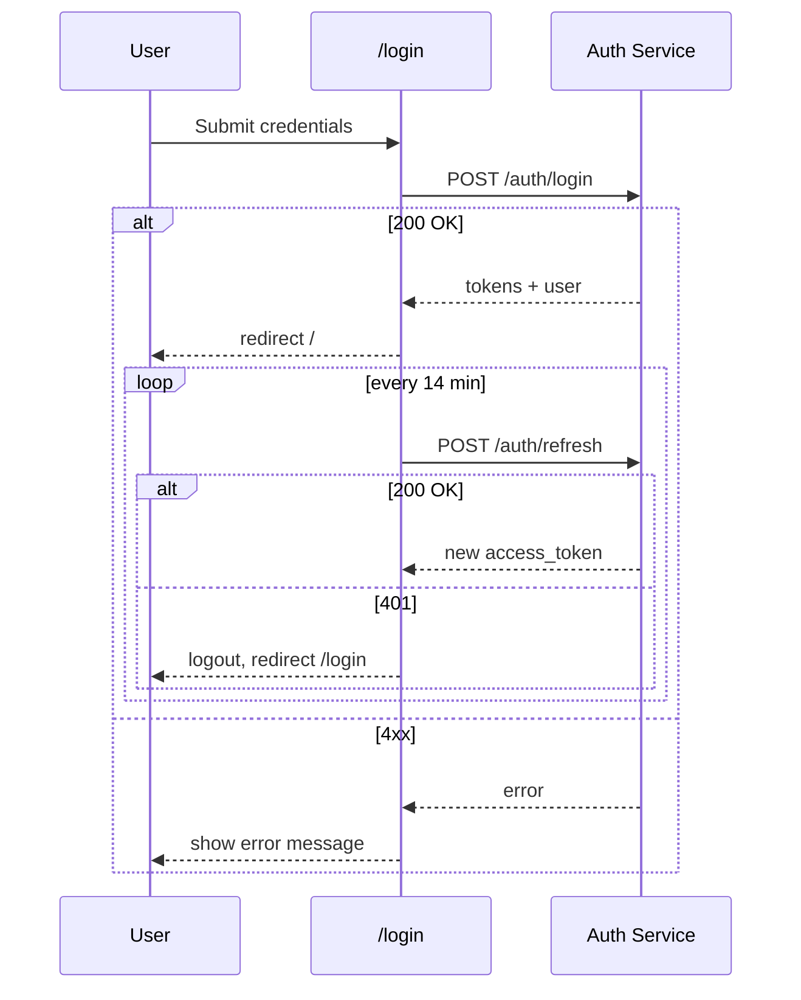
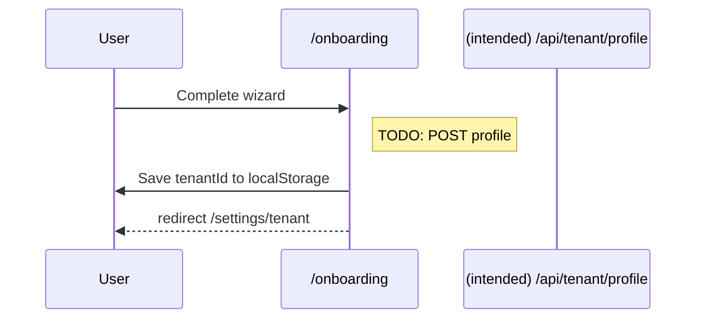

# Current-State UX Map

## Global Architecture
- **App Framework**: Next.js App Router
- **Root Layout**: `apps/web/src/app/layout.tsx`
  - Providers: `PlatformSettingsProvider`, `AuthProvider`
  - Wrappers: `ErrorBoundary`, `DynamicFavicon`
- **State/Contexts**
  - **Auth**: `apps/web/src/contexts/AuthContext.tsx`
    - JWT-based, tokens in localStorage (`access_token`, `refresh_token`)
    - `AuthProvider` calls `/auth/me`, `/auth/refresh`, `/auth/logout` on `${NEXT_PUBLIC_API_BASE_URL}`
    - Refresh interval: every 14 minutes
    - `user.tenants[]` drives current tenant; stored also as `current_tenant_id`
  - **Platform Settings**: `apps/web/src/contexts/PlatformSettingsContext`
- **Feature Flags**: `apps/web/src/lib/featureFlags/index.ts`
  - `FF_BUSINESS_PROFILE = on`
  - `FF_GOOGLE_CONNECT_SUITE = pilot (regions: us-east-1)`
  - `FF_MAP_CARD = off`, `FF_SWIS_PREVIEW = off`, `FF_DARK_MODE = off`

## Top-Level Navigation and Layout
- **Public Header (Home)**: Logo/name, `Settings`, `Sign In`
- **Page Header (inner pages)**: `components/PageHeader.tsx`
  - Title, description, icon, persistent Settings button, optional back link
- **Footer**: `components/PublicFooter`

## Routes and Pages (Primary)
- **Public**
  - `/login` Login form → redirects to `/` after success
  - `/register` Registration page
  - `/faq`, `/features` Informational
- **Authenticated**
  - `/` Dashboard-style home
    - Redirects unauthenticated → `/login`
    - Calls: `/api/tenants`, then `/api/tenants/{id}`, `/api/items?tenantId={id}`
    - Quick links: `/items`, `/tenants`, `/settings/*`
  - `/items` Inventory list and actions
  - `/tenants` Tenants overview/selection
  - `/tenants/[id]/users` Tenant user management
  - `/onboarding?tenantId={tid}` Business Profile Onboarding Wizard
    - Stores `tenantId` in localStorage on completion
    - Redirects to `/settings/tenant`
  - `/settings` Hub (cards-based IA)
    - Account & Preferences: `/settings/offerings`, `/settings/subscription`, `/settings/appearance`, `/settings/language`
    - Tenant Management: `/settings/tenant`, `/tenants/users` (pushes to `/tenants/{id}/users` if `tenantId` set)
    - Organization: `/settings/organization`
    - Admin: `/settings/admin`, `/settings/admin/users`, `/settings/admin/permissions`, `/settings/admin/features`, `/settings/admin/branding`, `/settings/admin/emails`, `/settings/admin/tenants`, `/settings/admin/upgrade-requests`
    - Support: `/settings/contact`

## Primary User Flows

### 1) Authentication


### 2) Dashboard Stats Fetch


### 3) Tenant Selection and Users
```mermaid
flowchart LR
  A[/settings/] --> B{Card clicked}
  B -->|Tenant Settings| C[Check localStorage.tenantId]
  C -->|exists| D[/settings/tenant]
  C -->|missing| E[/tenants]
  B -->|Tenant Users| F[Check localStorage.tenantId]
  F -->|exists| G[/tenants/{id}/users]
  F -->|missing| E[/tenants]
```

### 4) Onboarding (Business Profile)
```mermaid
flowchart TD
  A[/onboarding?tenantId=tid/] --> B{tenantId present?}
  B -->|No| C[/tenants]
  B -->|Yes| D[OnboardingWizard]
  D --> E[Complete]
  E --> F[Save tenantId to localStorage]
  F --> G[/settings/tenant]
```

## API Touchpoints (Web App)
- Next.js API routes used by UI (non-exhaustive):
  - Tenants: `/api/tenants`, `/api/tenants/[id]`, `/api/tenants/[id]/users`, `/api/tenants/[id]/logo`, `/api/tenants/[id]/items`
  - Items: `/api/items`, `/api/items/[id]`, `/api/items/[id]/photos`
  - Categories: `/api/categories`, `/api/categories/[id]`
  - Org/Requests/Permissions: `/api/organizations`, `/api/organization-requests`, `/api/permissions`
  - Google Connect: `/api/google/auth`, `/api/google/status`, `/api/google/disconnect`
  - Auth artifact: `/api/auth/[...nextauth]` present, but app state uses `${NEXT_PUBLIC_API_BASE_URL}/auth/*`

## State & Patterns
- **AuthContext** orchestrates token lifecycle and `user` state
- **Tenant context**: primarily via `localStorage.tenantId`; some pages compute from `/api/tenants`
- **Errors/Loading**: `ErrorBoundary`; spinners and conditional rendering per page

## Pain Points / Risks
- Reliance on localStorage for critical tenant context (selection/switch)
- Onboarding save-to-API TODO in wizard
- Two auth approaches present (NextAuth route vs custom JWT service)
- Minor UX: Home header shows Sign In while home enforces auth

## Feature Flags Snapshot
- `FF_BUSINESS_PROFILE`: enabled for all (100%)
- `FF_GOOGLE_CONNECT_SUITE`: pilot strategy (us-east-1 region)
- `FF_MAP_CARD`, `FF_SWIS_PREVIEW`, `FF_DARK_MODE`: disabled

## Page→API Dependency Matrix (key pages)
- **/** (Home Dashboard)
  - GET `/api/tenants`
  - GET `/api/tenants/{id}` (selected tenant)
  - GET `/api/items?tenantId={id}`
  - Edge cases: empty tenants → metrics zero; API errors → console, fallback zeros

- **/items**
  - GET `/api/items?tenantId={id}`
  - POST `/api/items` (creation flows in components)
  - POST `/api/items/{id}/photos` (upload)
  - Edge cases: missing `tenantId` → route likely pushes to `/tenants`

- **/tenants**
  - GET `/api/tenants`
  - GET `/api/tenants/{id}` (when selecting)
  - Edge cases: first-time users must create/select before proceeding

- **/tenants/[id]/users**
  - GET `/api/tenants/{id}/users`
  - PATCH `/api/permissions` (bulk updates)
  - Edge cases: unauthorized roles → UI restrictions

- **/onboarding?tenantId={tid}`**
  - Intended: POST `/api/tenant/profile` (TODO in wizard)
  - Edge cases: missing `tenantId` → redirect `/tenants`

- **/settings** (hub)
  - Navigation only; child pages call:
    - `/settings/tenant`: GET `/api/tenant/profile`, PATCH `/api/tenant/profile` (expected)
    - `/settings/organization`: GET `/api/organizations`
    - Admin pages: various `/api/*` endpoints (branding, emails, features, tenants)

- **AuthContext backend (external)**
  - POST `${API_BASE}/auth/login`
  - GET `${API_BASE}/auth/me`
  - POST `${API_BASE}/auth/refresh`
  - POST `${API_BASE}/auth/logout`

## Expanded Flow Diagrams (edge cases)

### Authentication with refresh and failures


### Home when tenant not selected or empty
```mermaid
flowchart TD
  A[/ ] --> B[GET /api/tenants]
  B -->|0 tenants| C[Show zeros + guide]
  B -->|tenants[]| D[Select tenant: localStorage or first]
  D --> E[GET /api/tenants/{id}]
  D --> F[GET /api/items?tenantId={id}]
  E --> G[Render metrics]
  F --> G
```

### Items access requiring tenant context
```mermaid
flowchart LR
  A[/items] --> B{localStorage.tenantId?}
  B -->|No| C[/tenants]
  B -->|Yes| D[GET /api/items?tenantId={id}]
  D --> E[Render list]
```

### Onboarding save TBD


---

# Appendices

## Settings Hub IA (Cards)
- Account & Preferences → Offerings, Subscription, Appearance, Language
- Tenant Management → Tenant Settings, Tenant Users (dynamic), Organization
- Administration → Admin, Users, Permissions, Features, Branding, Emails, Tenants, Upgrade Requests
- Support → Contact

## Open Items for New Spec
- Define personas & scenarios to prioritize navigation
- Replace localStorage tenant selection with URL/server-driven state
- Consolidate authentication strategy
- Complete backend save for Business Profile onboarding
- Build page→API dependency matrix with SLAs and error strategies
