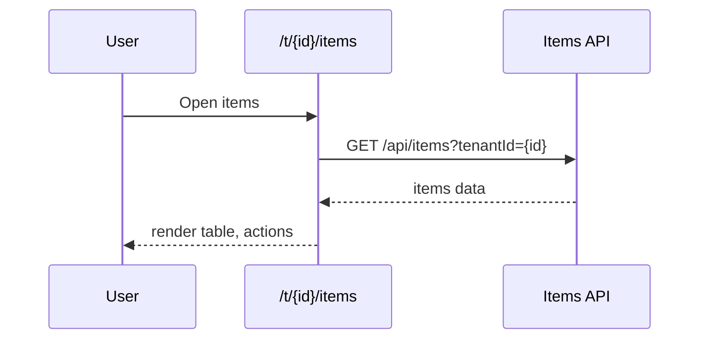
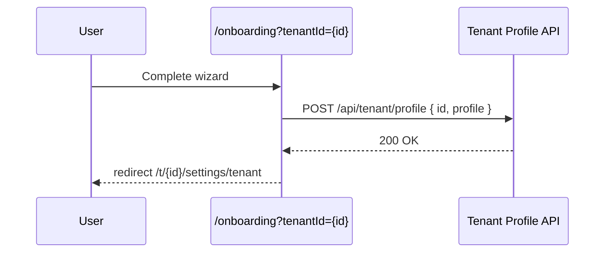

# Target-State UX and IA Specification

## Personas and Top Tasks
- **Store Owner (Single-Location)**
  - Goals: set up business profile, upload products, sync to Google, monitor stock.
  - Top tasks: Onboard tenant, manage items/photos, view low-stock alerts.
- **Operations Manager (Multi-Location/Chain)**
  - Goals: manage multiple tenants, roles, chain-wide metrics.
  - Top tasks: Switch tenants, manage users/permissions, review organization dashboard.
- **Platform Admin**
  - Goals: oversee platform configuration and org requests, feature rollout.
  - Top tasks: user admin, permissions matrix, features, branding/emails.

## Target Information Architecture (IA)
- **Global Nav (App Shell)**
  - Dashboard (/)
  - Inventory (/items)
  - Tenants (/tenants)
  - Settings (/settings)
  - Profile/Sign out (account menu)
- **Settings Hub Structure** (unchanged in grouping, refined labels)
  - Account & Preferences → Appearance, Language
  - Subscription & Billing → Offerings, Subscription
  - Tenant Management → Tenant Settings, Tenant Users, Organization
  - Administration → Admin, Users, Permissions, Features, Branding, Emails, Tenants, Upgrade Requests
  - Support → Contact

## Navigation and Context Strategy
- **Tenant Context: URL/Server-Driven (replace localStorage as source of truth)**
  - Pattern: parameterize tenant in path or query for tenant-scoped pages.
    - Example: `/t/{tenantId}/items`, `/t/{tenantId}/settings/tenant`, `/t/{tenantId}/users`.
  - Client keeps a lightweight cache, but SSR/route params resolve the authoritative tenant.
  - Provide a tenant switcher in the header that updates the URL and persists preference to localStorage only as a hint.
- **Default Tenant Resolution**
  - If user has one tenant → auto-redirect to `/t/{id}/...` equivalent when entering generic pages.
  - If multiple → route to `/tenants` selector, then push to chosen `/t/{id}/...`.

## Authentication Strategy (Consolidation)
- **Single approach**: Use the custom JWT service (current) or migrate fully to NextAuth.
  - Recommendation: continue custom JWT service for now; remove unused NextAuth route to reduce confusion.
  - Standardize fetch: an API client that injects bearer token, handles 401 refresh transparently, and centralizes errors.
- **Session Refresh**
  - Keep 14-min refresh interval; additionally refresh on 401 challenge at call site.

## Target User Flows

### Auth and Tenant Bootstrapping
```mermaid
flowchart TD
  A[Visit app] --> B{Has valid session?}
  B -->|No| C[/login]
  B -->|Yes| D{Has one tenant?}
  D -->|Yes| E[/t/{id}/]
  D -->|No| F[/tenants]
  F --> G[Select tenant]
  G --> E[/t/{id}/]
```

### Inventory with URL-Driven Tenant


### Business Profile Onboarding (Completed Save)


## Feature Flag Plan (Retrofit New Requirements)
- Use existing `lib/featureFlags` and add:
  - `FF_TENANT_URLS`: gates URL-driven routing.
  - `FF_APP_SHELL_NAV`: gates new header/tenant switcher.
- Rollout strategy: pilot → percentage → on; cohort by tenantId and region.

## Page→API Contract Guidelines (Target)
- All tenant-scoped endpoints accept `tenantId` explicitly (path or query).
- Responses provide clear error codes for auth (401), permission (403), missing tenant (404), and validation (422).
- Client retries on 429/5xx with backoff (max 2 retries).

## Error and Loading Patterns
- Standardized skeletons for tables/cards.
- Toasts for success/fail; inline field errors for forms.
- Central error boundary remains; API client normalizes messages.

## Migration Plan (Phased)
1. Introduce API client abstraction with token injection and 401 refresh.
2. Add tenant switcher in header; keep current pages but persist selected tenant to URL when possible.
3. Ship `/t/{tenantId}/...` routes in parallel with current routes; add redirects.
4. Migrate key pages: `/items`, `/settings/tenant`, `/tenants/[id]/users` to URL-driven context.
5. Complete onboarding save; update redirects to `/t/{id}/settings/tenant`.
6. Remove NextAuth route; update docs and configs.
7. Turn on `FF_TENANT_URLS`, then `FF_APP_SHELL_NAV`; ramp to 100%.

## Risks and Mitigations
- Broken deep links during route transition → provide redirects and clear 404 fallbacks.
- Mixed tenant context during rollout → source-of-truth is URL; localStorage only a hint.
- Auth drift → e2e tests around login/refresh/logout; observability on 401 rates.
