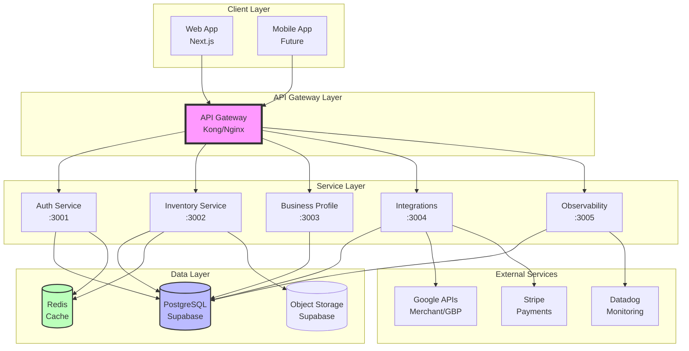
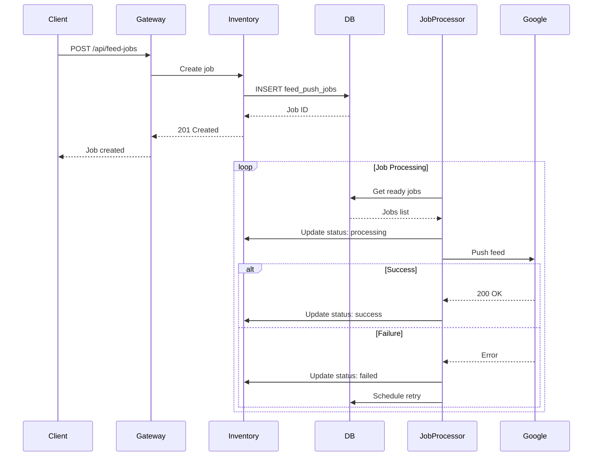
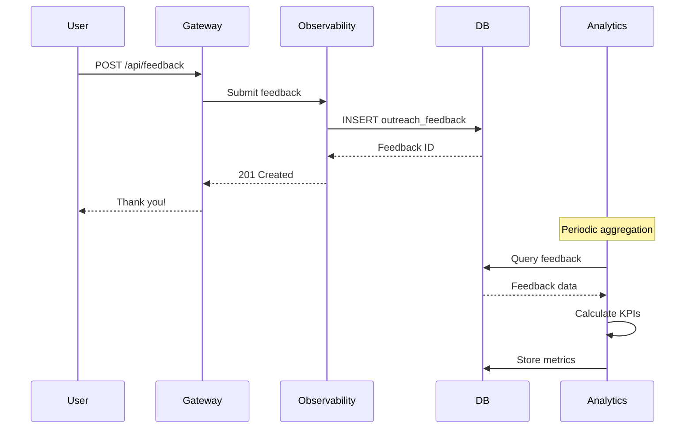
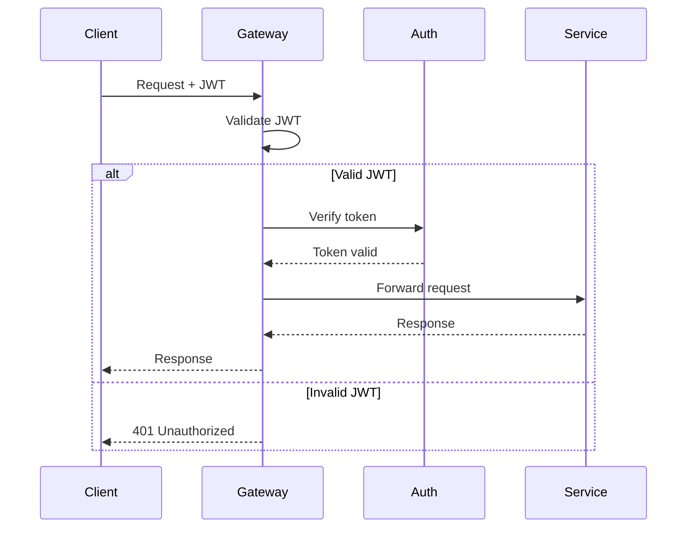
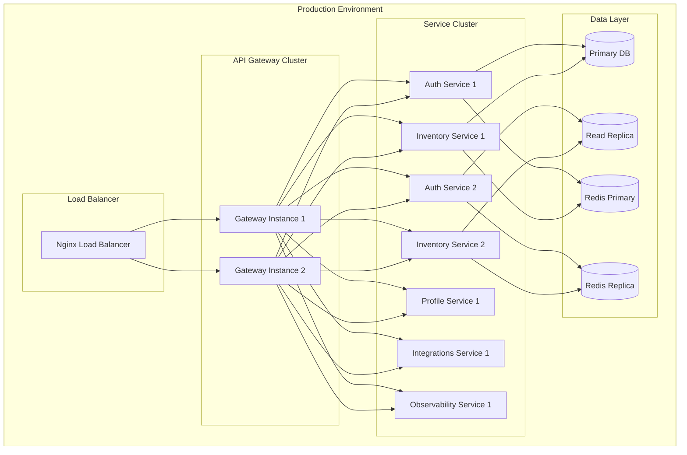
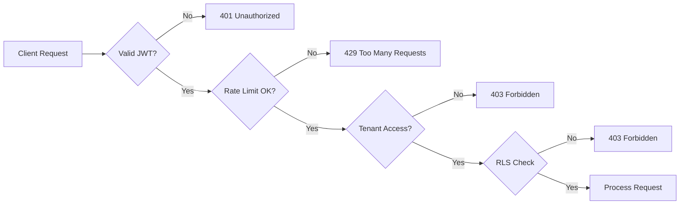

# System Architecture Overview
**Version:** v3.6.2-prep  
**Date:** 2025-11-01  
**Status:** Implementation

---

## High-Level Architecture



---

## Service Boundaries

### 1. Auth Service (Port 3001)
**Responsibility:** User authentication, tenant sessions, RLS policies

**Owns:**
- `tenant` table
- `user` table
- `user_tenant` table
- `user_session` table
- `permission_matrix` table

**API Endpoints:**
- `POST /auth/login`
- `POST /auth/logout`
- `POST /auth/register`
- `POST /auth/refresh`
- `POST /auth/step-up`
- `GET /auth/session`

**Dependencies:**
- PostgreSQL (user/tenant data)
- Redis (session storage)

---

### 2. Inventory Service (Port 3002)
**Responsibility:** SKU CRUD, category management, feed sync

**Owns:**
- `inventory_item` table
- `tenant_category` table
- `google_taxonomy` table
- `feed_push_jobs` table ✨ NEW
- `category_alignment_audit` table

**API Endpoints:**
- `GET/POST/PUT/DELETE /api/v1/tenants/:tenantId/inventory`
- `GET/POST/PUT/DELETE /api/v1/tenants/:tenantId/categories`
- `POST /api/v1/tenants/:tenantId/categories/:id/align`
- `POST /api/v1/tenants/:tenantId/feed/precheck`
- `POST /api/v1/tenants/:tenantId/feed/push`
- `GET /api/feed-jobs` ✨ NEW
- `PATCH /api/feed-jobs/:id/status` ✨ NEW

**Dependencies:**
- PostgreSQL (inventory data)
- Redis (cache)
- Object Storage (images)
- Observability (metrics)

---

### 3. Business Profile Service (Port 3003)
**Responsibility:** NAP data, hours, SEO, maps

**Owns:**
- `tenant_business_profile` table

**API Endpoints:**
- `POST /tenant/profile`
- `GET /tenant/profile`
- `PATCH /tenant/profile`
- `GET /tenant/profile/validation`

**Dependencies:**
- PostgreSQL (profile data)
- Google Maps API (geocoding)

---

### 4. Integrations Service (Port 3004)
**Responsibility:** OAuth, Google Merchant, GBP, Stripe

**Owns:**
- `google_oauth_accounts` table
- `google_oauth_tokens` table
- `google_merchant_links` table
- `gbp_locations` table
- `gbp_insights_daily` table

**API Endpoints:**
- `POST /google/oauth/link`
- `GET /google/oauth/callback`
- `POST /google/oauth/refresh`
- `DELETE /google/oauth/unlink`
- `POST /google/feeds/push`
- `POST /stripe/checkout`
- `POST /stripe/webhook`

**Dependencies:**
- PostgreSQL (integration data)
- Redis (token cache)
- Google APIs (Merchant, GBP)
- Stripe API

---

### 5. Observability Service (Port 3005)
**Responsibility:** Metrics, alerts, audit logs, feedback

**Owns:**
- `audit_log` table
- `outreach_feedback` table ✨ NEW

**API Endpoints:**
- `POST /metrics/export`
- `GET /metrics/dashboard/:dashboardId`
- `POST /api/feedback` ✨ NEW
- `GET /api/feedback/analytics/summary` ✨ NEW
- `GET /api/feedback/pilot/kpis` ✨ NEW
- `GET /audit/:tenantId/logs`

**Dependencies:**
- PostgreSQL (audit/feedback data)
- Datadog (metrics sink)
- Sentry (error tracking)

---

## Data Flow Diagrams

### Feed Push Job Flow



### Feedback Collection Flow



---

## API Gateway Configuration

### Routing Rules

| Path Pattern | Target Service | Auth Required | Rate Limit |
|--------------|----------------|---------------|------------|
| `/auth/*` | Auth Service | No | 500/min |
| `/api/v1/tenants/:id/inventory*` | Inventory | Yes | 1000/min |
| `/api/v1/tenants/:id/categories*` | Inventory | Yes | 1000/min |
| `/api/feed-jobs*` | Inventory | Yes | 500/min |
| `/tenant/profile*` | Business Profile | Yes | 300/min |
| `/google/*` | Integrations | Yes | 200/min |
| `/stripe/*` | Integrations | Yes | 200/min |
| `/api/feedback*` | Observability | Yes | 500/min |
| `/metrics/*` | Observability | Admin | 500/min |

### Rate Limiting Strategy

```yaml
global:
  requests_per_minute: 1000
  burst: 100

per_service:
  auth: 500
  inventory: 1000
  business_profile: 300
  integrations: 200
  observability: 500

per_tenant:
  requests_per_minute: 100
  burst: 20
```

### Authentication Flow



---

## Deployment Architecture



---

## Security Architecture

### Authentication Layers

1. **API Gateway Level**
   - JWT validation
   - Rate limiting
   - IP whitelisting (admin routes)

2. **Service Level**
   - Tenant context verification
   - Role-based access control (RBAC)
   - Step-up authentication for sensitive ops

3. **Database Level**
   - Row Level Security (RLS)
   - Tenant isolation
   - Audit logging

### Security Flow



---

## Scalability Strategy

### Horizontal Scaling

| Service | Min Replicas | Max Replicas | Scale Trigger |
|---------|--------------|--------------|---------------|
| Auth | 2 | 5 | CPU > 70% |
| Inventory | 3 | 10 | CPU > 70% |
| Business Profile | 2 | 5 | CPU > 70% |
| Integrations | 2 | 5 | Queue depth > 100 |
| Observability | 2 | 5 | CPU > 70% |

### Database Scaling

- **Read Replicas:** 2 replicas for read-heavy operations
- **Connection Pooling:** PgBouncer (max 100 connections per service)
- **Caching Strategy:** Redis for hot data (TTL: 5-60 minutes)

---

## Monitoring & Observability

### Key Metrics

**Service Health:**
- Uptime percentage
- Request rate (req/s)
- Error rate (%)
- Latency (p50, p95, p99)

**Business Metrics:**
- Feed push success rate
- Category mapping coverage
- Feedback satisfaction rate
- Pilot program KPIs

**Infrastructure:**
- CPU usage
- Memory usage
- Database connections
- Cache hit rate

### Alerting Strategy

| Alert | Threshold | Severity | Channel |
|-------|-----------|----------|---------|
| Service Down | Uptime < 99.9% | Critical | PagerDuty |
| High Error Rate | Errors > 5% | High | Slack |
| High Latency | p95 > 1s | Medium | Slack |
| Feed Failures | Success < 90% | High | Slack |
| Low Satisfaction | Score < 80% | Medium | Email |

---

## Disaster Recovery

### Backup Strategy
- **Database:** Automated daily backups, 30-day retention
- **Point-in-Time Recovery:** 7-day window
- **Object Storage:** Geo-redundant replication

### Recovery Time Objectives
- **RTO (Recovery Time Objective):** 1 hour
- **RPO (Recovery Point Objective):** 5 minutes

---

## Technology Stack

| Layer | Technology | Purpose |
|-------|------------|---------|
| **Frontend** | Next.js 15 | Web application |
| **API Gateway** | Kong/Nginx | Routing, rate limiting |
| **Backend** | Node.js + Express | API services |
| **Database** | PostgreSQL (Supabase) | Primary data store |
| **Cache** | Redis | Session, hot data |
| **Storage** | Supabase Storage | Images, files |
| **Monitoring** | Datadog | Metrics, logs, APM |
| **Error Tracking** | Sentry | Error monitoring |
| **CI/CD** | GitHub Actions | Automation |
| **Deployment** | Vercel/Railway | Hosting |

---

**Last Updated:** 2025-11-01  
**Next Review:** After Day 3 completion
